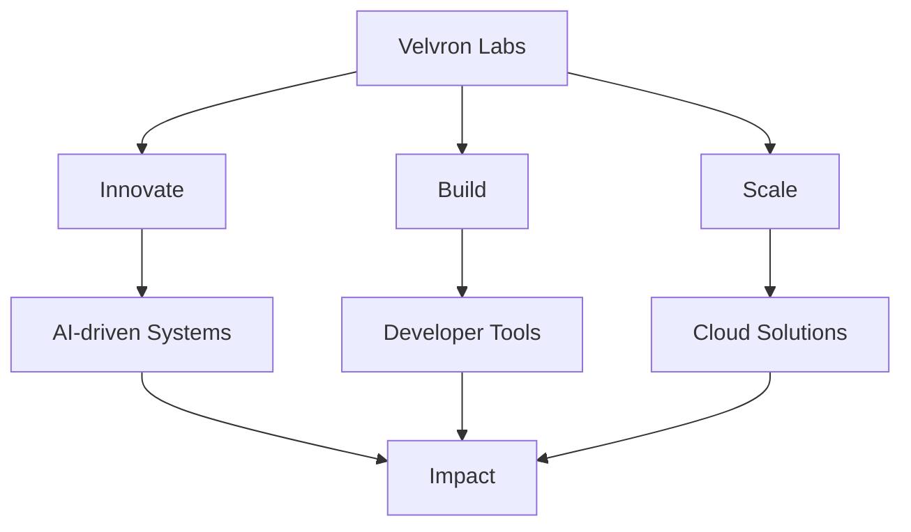

# 🚀 Velvron Labs

<p align="center">
  <b>Engineering the Future, One Line of Code at a Time</b>
</p>

<p align="center">
  
  
  
  
</p>

<p align="center">
  <a href="https://velvronlabs.vercel.app">🌐 Website</a> • <a href="mailto:brownnestro0@gmail.com">📧 Email</a> • <a href="https://www.linkedin.com/in/nestro-brown-0b2734361/">💼 LinkedIn</a>
</p>

---

## 📚 Table of Contents
1. [About Us](#about-us)
2. [Tech Stack](#tech-stack)
3. [Features](#features)
4. [Vision & Mission](#vision--mission)
5. [What We're Working On](#what-were-working-on)
6. [Contact](#contact)
7. [Development](#development)

---

## 🏢 About Us

Velvron Labs is more than just a company — it's a mindset. We focus on:

- **Innovation-First Engineering** — pushing boundaries of AI, cloud, and automation
- **Scalable Solutions** — building tech that grows as you grow
- **Purpose-Driven Design** — creating tools that matter

> Founded in **2025**, we're small but mighty — and ready to shake things up.

## 🛠️ Tech Stack

### Core
- **Framework**: Next.js 14 with App Router
- **Language**: TypeScript
- **Styling**: Tailwind CSS
- **Animation**: Framer Motion & GSAP
- **Form Handling**: React Hook Form

### Integrations
- **Email Service**: EmailJS for contact form
- **Security**: Google reCAPTCHA v2
- **Icons**: Lucide React
- **3D Graphics**: Three.js

### Development Tools
- **Package Manager**: npm
- **Linting**: ESLint
- **Formatting**: Prettier
- **Version Control**: Git

## ✨ Features

### Contact Form
- Secure form submission with reCAPTCHA v2
- Client-side validation
- Rate limiting to prevent spam
- Responsive design for all devices
- Loading states and error handling
- Email notifications via EmailJS

### Performance
- Code splitting and lazy loading
- Optimized animations
- Responsive images
- Modern CSS with Tailwind

### Developer Experience
- TypeScript for type safety
- Component-based architecture
- Reusable UI components
- Environment variable support

---

## 📈 Vision & Mission



> **Turn ambitious ideas into transformative products.**

---

## 🛠️ What We’re Working On

- 🤖 AI research & prototyping
- ☁️ High-performance cloud architectures
- 🛠️ Sleek, developer-friendly tools
- 🧪 Experimental open-source frameworks

---

## 📬 Contact

Got questions or want to collaborate? Reach out through our contact form or directly at:

- **Email**: [brownnestro0@gmail.com](mailto:brownnestro0@gmail.com)
- **LinkedIn**: [Nestro Brown](https://www.linkedin.com/in/nestro-brown-0b2734361/)
- **Website**: [velvronlabs.vercel.app](https://velvronlabs.vercel.app)

## 🚀 Development

### Prerequisites
- Node.js 18+
- npm 9+

### Getting Started

1. Clone the repository
   ```bash
   git clone https://github.com/yourusername/velvron-labs.git
   cd velvron-labs
   ```

2. Install dependencies
   ```bash
   npm install
   ```

3. Set up environment variables
   Create a `.env.local` file in the root directory with:
   ```
   NEXT_PUBLIC_RECAPTCHA_SITE_KEY=your_recaptcha_site_key
   NEXT_PUBLIC_EMAILJS_SERVICE_ID=your_emailjs_service_id
   NEXT_PUBLIC_EMAILJS_TEMPLATE_ID=your_emailjs_template_id
   NEXT_PUBLIC_EMAILJS_PUBLIC_KEY=your_emailjs_public_key
   ```

4. Run the development server
   ```bash
   npm run dev
   ```

5. Open [http://localhost:3000](http://localhost:3000) in your browser

### Building for Production

```bash
npm run build
npm start
```

### Environment Variables
- `NEXT_PUBLIC_RECAPTCHA_SITE_KEY`: Google reCAPTCHA v2 site key
- `NEXT_PUBLIC_EMAILJS_SERVICE_ID`: EmailJS service ID
- `NEXT_PUBLIC_EMAILJS_TEMPLATE_ID`: EmailJS template ID
- `NEXT_PUBLIC_EMAILJS_PUBLIC_KEY`: EmailJS public key

---

<p align="center">
  <sub>© 2025 Velvron Labs. All rights reserved.</sub>
</p>